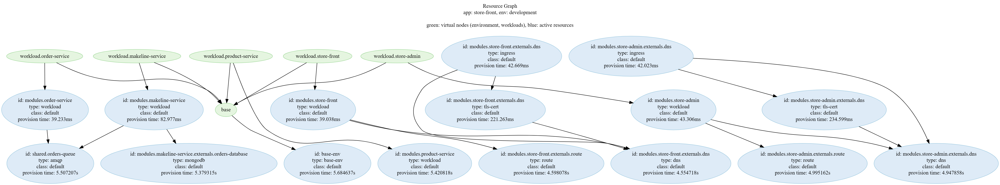

# aks-store-demo

Get the [Azure-Samples/aks-store-demo](https://github.com/Azure-Samples/aks-store-demo) to Score and Humanitec.


## Local deployment

You will need to [install `score-compose`](https://docs.score.dev/docs/score-implementation/score-compose/) locally.

_Note: there is a current issue in `score-compose` not supporting yet the `service` resources. [Coming soon](https://github.com/score-spec/score-compose/issues/118)._

Deploy locally:
```bash
make compose-up
```

## Humanitec deployment

You will need to [install `humctl`](https://developer.humanitec.com/platform-orchestrator/cli/) locally.

Deploy to Humanitec:
```bash
export HUMANITEC_ORG=FIXME
export HUMANITEC_APPLICATION=store-front
export HUMANITEC_ENVIRONMENT=development

humctl login

humctl create app ${HUMANITEC_APPLICATION} \
    --name ${HUMANITEC_APPLICATION}

humctl apply \
    -f resources/in-cluster-rabbitmq.yaml
humctl apply \
    -f resources/in-cluster-mongodb.yaml

make humanitec-deploy
```

Get the generated DNS one the deployment is done:
```bash
humctl get active-resources \
	--app ${HUMANITEC_APPLICATION} \
	--env ${HUMANITEC_ENVIRONMENT} \
	-o json \
	| jq -c '.[] | select(.metadata.type | contains("dns"))' \
	| jq -r .status.resource.host
```

Here the associated resource graph generated by Humanitec:

